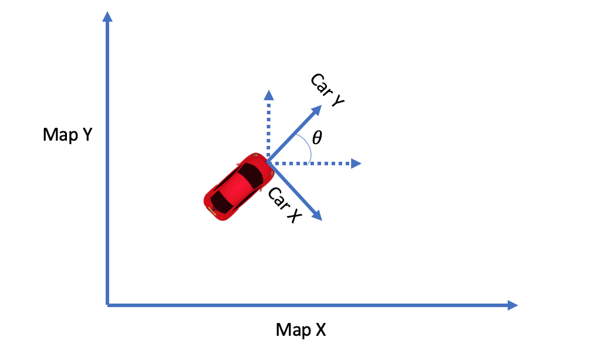

# Project: Highway Driving (Path Planning in C++)


## Particle Filters
In this project, the goal is to design a path planner that is able to create smooth, safe paths for the car to follow along a 3 lane highway with traffic. The path planner will be able to keep inside its lane, avoid hitting other cars, and pass slower moving traffic all by using localization, sensor fusion, and map data.

<p>
    
    <br>
    <em>Block Diagram of Path Planning.</em>
</p>

## Project files
### The codes
In addition to the original scripts from the project repository, I updated main.cpp and added two other header files.
Here is the summary of the updates:

* [src/spline.h](src/spline.h)    [Cubic Spline](https://kluge.in-chemnitz.de/opensource/spline) interpolation routines suggested by the project instruction.
* [src/supports.h](src/supports.h) 
    * `predict_cars_movement()`         Update nearby cars' location per each car's sensed velocity. 
    * `pickLane()`                      Decide the next lane the car will be in.
    * `decideAccel()`                   Increase/decrease/maintain the acceleration per clearance ahead. 
    * `computeNewVelocity()`            Compute new velocity by given original velocity and acceleration.  
    * `computeTravelDist()`             Compute travel distance by given velocity and acceleration.
    * `transMap2Car()`                  Transform map coordinates to car's local coordinates. 
    * `transCar2Map()`                  Transform car's local coordinates to map coordinates.
    
* [src/main.cpp](src/main.cpp)     Main script that contains the Path Planning's flow.


### The results
Screen recordings of the simulator to show the final results.
* [Youtube Video](https://youtu.be/dLjtK9FXfMs)            Running the car simulator with the Path Planning routines.

## Highlights of the codes 

### `predict_cars_movement()`
In this procedure, All nearby cars' new locations are updated according to velocities in both $x$ and $y$ directions.
Here we only use a simple ${New \space location} = {Previous \space location} + Velocity \times \Delta {Time}$ to predict each car's new location.
```cpp
    pred_x  = sensor_data[i].x + sensor_data[i].vx * delta_t;
    pred_y  = sensor_data[i].y + sensor_data[i].vy * delta_t;
```

### `pickLane()`
Each time this function is called, it evaluates the current lane itself and lanes next to it.  If the car is in the right-most or left-most lanes, only two lanes need to be evaluated. 

<p>
    
    <br>
    <em>Candidate lanes to evaluate</em>
</p>

For each lane needs to be checked, `pickLane()` computes the overall cost of each lane according with the initial cost $ \left | L - P \right |$, where $L$ is the current lane's number and $P$ is the preferred lane's number. 
Then an equation $ 1- \frac{1}{e^{\left | L - P \right |}} $ is used to obtain a `cost multiplier` that will be zero only when the car is in the preferred lane.

For each lane being evaluated, I check if there is car in specific zone of the lane. A yellow zone is a look-ahead zone in which cars doesn't cause hazard, while red zone is for checking if there is car that might cause collision.

<p>
    
    <br>
    <em>Evaluate cost of each lane</em>
</p>

For each car in the yellow zone, the cost will be $200 * (1-e^{-\frac{1}{Distance}})$.  Any car in the red zone will be given ten times of cost, $2000 * (1-e^{-\frac{1}{Distance}})$, to prevent the car from crashing into other cars.


### `decideAccel()`
The acceleration decide the new acceleration by looking ahead.  If there is a car ahead in the red zone, the acceleration will be $-8$ (hard-coded in the script).  Otherwise, the acceleration will be $+8$ until it reaches the speed limit.  If the speed limit is reached, the acceleration will then be $0$.

<p>
    
    <br>
    <em>Deciding the acceleration</em>
</p>


### `computeNewVelocity()`
The new velocity of the car is computed with the following equation.

$V_{new} = V_{old} + Accel \times \Delta {time}$

In this case, the $\Delta_{time}$ is $20 ms$ since the simulator's processing rate is 20 ms per waypoint.

### `computeTravelDist()`
This routine plays a crucial part of creating new waypoint. For each time frame $(20 ms)$, I computer the new travel distance with the equation.

$Distance = V_{current} \times {\Delta {time}} + Accel \times {\Delta {time}}^2$


### `transMap2Car()` and `transCar2Map`
This two fuction simply use the following codes to transform coordinates between map and car coordinates system:

Transforming map coordinates to car coordinates.
```cpp
  double shift_x = map_wp[0] - car_map_wp[0];
  double shift_y = map_wp[1] - car_map_wp[1];
  double car_x = (shift_x*cos(0.0-ref_theda)-shift_y*sin(0.0-ref_theda));
  double car_y = (shift_x*sin(0.0-ref_theda)+shift_y*cos(0.0-ref_theda));
  return {car_x, car_y};
```

Transforming car coordinates to map coordinates.
```cpp
  double map_x = (car_wp[0]*cos(ref_theda)-car_wp[1]*sin(ref_theda)) + car_map_wp[0];
  double map_y = (car_wp[0]*sin(ref_theda)+car_wp[1]*cos(ref_theda)) + car_map_wp[1];
  return {map_x, map_y};
```
<p>
    
    <br>
    <em>Coordinates transformation between map (world) and car</em>
</p>

### Main program
In the main program, I kept or updated waypoints by taking network latency into account. Since I was running the simulator and the main program on seperate machines. I pick 300 ms as the expected network latency.  That is, only first waypoint through 15th waypoint will be kept in order to keep the car driving correctly. All nearby cars' location will also be updated up to the time before 16th waypoint is consumed.  In stead of filling up the vacancy by adding a few waypoints, I decided to update waypoints that were sent last time but havn't been consumed by the car.
This would enhance the ability react to hazard as eraly as possible.

<p>
    
    <br>
    <em>Waypoints 16th through 50th will be updated in each iteration</em>
</p>


The 15 wayponts will be used by Cubic Spline interpolation routine as starting points. Then I added three new waypoints at 30m, 60m and 90m ahead of the car with gently increasing displacement at $\frac{1}{2}\Delta d$, $\frac{3}{4}\Delta d$, and $\Delta d$.  This will prevent jerk and avoid collision in some cases since it gives more margin to the lane planner to avoid collision. 

<p>
    
    <br>
    <em>Smooth lane changing</em>
</p>

The 15+3 waypoints were passed to `tk::spline` to generate a smooth trajectory.

```cpp
          tk::spline spl;
          spl.set_points(ptsx, ptsy);
```

Once the trajectory was decided, I computed the travel distance ${d\_dist}$ and obtain the new coordinate at $x$ axis of the car's coordinates system.  Then I looked up new coordinate at $y$ axis with `tk::spline`'s look-up function.
The new coordinates $(x, y)$ are transformed to map coordinates.  Finally, I predicted all nearby cars location by calling `predic_cars_movement()` and dicided the new acceleration before working on a new waypoint.

```cpp
          double plan_v = curr_v;
          double plan_acc = curr_spd_acc;
          double prev_plan_acc = curr_spd_acc;

          vector<double> prev_map_wp = transCar2Map({x_p, y_p}, {ref_x, ref_y}, ref_theta);
          for (int i=0; i < NUM_WAYP - last_idx; i++) {
            double d_dist = computeTravelDist(plan_v, plan_acc, CYCLE_TIME);
            plan_v  = computeNewVelocity(plan_v, plan_acc, SPEED_LIMIT, CYCLE_TIME);

            x_p += d_dist*cos(prev_theta);
            double y_p = spl(x_p);
              
            vector<double> map_wp = transCar2Map({x_p, y_p}, {ref_x, ref_y}, ref_theta);

            next_x_vals.push_back(map_wp[0]);
            next_y_vals.push_back(map_wp[1]);

            prev_theta  = atan2(y_p-prev_y_p, x_p-prev_x_p);
            prev_x_p    = x_p;
            prev_y_p    = y_p;

            double prev_map_theta  = atan2(map_wp[1]-prev_map_wp[1], map_wp[0]-prev_map_wp[0]);

            predict_cars_movement(CYCLE_TIME, cars_sensor_data, map_waypoints_x, map_waypoints_y);
            vector<double> map_sd = getFrenet(map_wp[0], map_wp[1], prev_map_theta, map_waypoints_x, map_waypoints_y);

            prev_plan_acc = plan_acc;
              
            plan_acc = decideAccel(SPEED_ACC_STEP, prev_plan_acc, SPEED_LIMIT, plan_v, HEAD_SAFE_DIST+plan_v, map_sd[0], LANE_WIDTH, map_sd[1], cars_sensor_data);
            prev_map_wp = map_wp;
          }

```


## Final Results
The car can drve for a long distance without any incident such as violating the speed limit, causing high acceleration and jerk, or crahing into other cars. It is able to change lane when necessary as required by the [project rubric](https://review.udacity.com/#!/rubrics/1971/view).   


